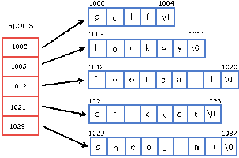

[^nt]: not tested, please contact author with use case
[^na]: this function call is not available in C++ API, use C API interop instead
[^failed]: test case failed, contact author with use case
[^ok]: tested function, performs as advertised

# HDF5
<p align='justify'>
Within an HDF5 container, datasets may be stored in [compact, chunked or contiguous](#dataset-creation-property-list) layouts. The  stored datasets are referenced by strings separated with backslash character: `/`.
The directory entries (non-leaf nodes) are called groups `h5::gr_t`, and the (terminal) leaf nodes are the datasets `h5::ds_t` and named types `h5::dt_t`. Groups, datasets and named types can have `h5::att_t` attributes attached. At first glance, an HDF5 container appears as a regular file system with a rich set of API calls.
</p>
## Layouts
#### Chunked Layout and Partial IO
An economic way to access massive data sets is to break them into smaller blocks or chunks. While the CAPI supports complex selections of regions, for now H5CPP provides only effective means for sub-setting with `h5::block{}`, `h5::stride{}`. (1)

Chunked layout may be requested by creating a dataset with `h5::chunk{..}` added to dataset creation property list which will implicitly set the `h5::layout_chunked` flag. 

```cpp
h5::ds_t ds = h5::create<double>(fd, "dataset", ...,
		h5::chunk{4,8} [| h5::fill_value<double>{3} |  h5::gzip{9} ] );
```
*The content of `[..]` are other optional dataset properties, `fd` is an opened HDF5 file descriptor of type `ht::fd_t`, `...` denotes omitted size definitions*

Let `M` be a supported object type, or a raw memory region. For simplicity we pick an armadillo matrix: `arma::mat M(20,16)`. Then, in order to save this matrix into a larger dataspace, we need to pass the `M` , the coordinates and possibly strides and blocks:
`h5::write( ds,  M, h5::offset{4,8}, h5::stride{2,2} )`. The H5 operator will identify the memory location of the object, the datatype and the size and delegates them to actual  IO calls.

When working with raw memory pointers, or when H5CPP doesn't yet know of the object type, you need to specify the size of the object with `h5::count{..}`. 

**Example:**

```cpp
h5::write( ds,  M.memptr(), h5::count{5,10} [, ...] );
```

The above operations can be expressed on a single line. To create a dataset of a size appropriate for partial IO, to add a filter, and then to write the entire content of the `M` matrix into the dataset is as simple as this:
```cpp
h5::write(fd, "dataset", M, h5::chunk{4,8} | h5::fill_value<double>{3} |  h5::gzip{9} );
```
To learn more about this topic [through examples click here](examples.md).


(1) *The rationale behind the decision is simplicity. Sub-setting requires to load data from disk to memory and then filter out the selected data, which doesn't lead to IO bandwidth savings, yet adds complexity.*


#### Contiguous Layout and IO Access
The simplest form of IO is to read a dataset entirely into memory, or write it to disk. The upside is to reduce overhead when working with a large amount of small size datasets. Indeed, when objects are saved in a single IO op and no filtering is specified, H5CPP will choose this access pattern.  The downside of simplicity is the lack of filtering. This layout is handy for small datasets.

**Example:** in the simplest case, `h5::write` opens `arma.h5` with write access, then creates a data set with the right dimensions, and the data transfer commences.
```
arma::vec V( {1.,2.,3.,4.,5.,6.,7.,8.});
h5::write( "arma.h5", "one shot create write",  V);
```
To force contiguous layout, you need to pass the `h5::contigous` flag with [`h5::dcpl_t`](#dataset-creation-property-list).
```
DATASET "one shot create write" {
      DATATYPE  H5T_IEEE_F64LE
      DATASPACE  SIMPLE { ( 8 ) / ( 8 ) }
      STORAGE_LAYOUT {
         CONTIGUOUS
         SIZE 64
         OFFSET 5888
      }
      FILTERS {
         NONE
      }
      FILLVALUE {
         FILL_TIME H5D_FILL_TIME_IFSET
         VALUE  H5D_FILL_VALUE_DEFAULT
      }
      ALLOCATION_TIME {
         H5D_ALLOC_TIME_LATE
      }
   }

```

#### Compact Layout
is there to store tiny data sets, perhaps the nodes of a very large graph. 


#### Data Space and Dimensions
tell the system how in-memory data is mapped to a file (or in reverse). To give you an example, picture a block of data in consecutive memory locations that you wish to write to a cube-shaped dataset. A data space may be of a fixed extent (size) or capable of extentsion to a definite or unlimited size along one or more dimensions.

When working with supported objects, the in-memory dataspace is pre-computed for you. And when passing raw pointers to IO operators, the filespace will determine the amount of memory used.

Lists to describe dimensions of a dataset:

* `h5::current_dims{i,j,k,..}` - actual extent (dimensions) `i,j,k \in {1 - max}`
* `h5::max_dims{...}` - maximum extent (dimensions), use `H5S_UNLIMITED` for infinite extent 
* `h5::chunk{...}` - define block size, clever blocking arrangement may increase throughout

Lists to make selections from datasets for read or write:

* `h5::offset{...}` - start coordinates of a data selection
* `h5::stride{...}` - every `n`-th element is considered 
* `h5::block{...}` - every `m` block is considered
* `h5::count{...}` - the number of blocks 

**Note:** `h5::stride`, `h5::block` and scatter - gather operations don't work when `h5::high_throughput` is set, due to performance reasons.

#IO Operators
<p align='justify'>
Modern C++ provides a rich set of features to create variables and implement program logic that is running inside the compiler. This compile-time mechanism, or template meta-programming, allows not only to match types but to pass arguments in arbitrary order; very similar to what we find in Python. The main difference however is in the implementation: the C++ version incurs no runtime overhead.
</p>

In the next sections we guide you through H5CPP's CRUD like operators: `h5::create`,`h5::read`,`h5::write`,`h5::append` and `h5::open`, `h5::close`.
The function calls are given in EBNF notation and we start with a few common tokens.


Think of an HDF5 file as a container, or an image of a file system with a non-traditional file API to access its content. These containers/images may be passed around with standard file operations between computers, while the content may be retrieved with HDF5-specific IO calls. To reference such a container within a standard file-system, you either need to pass an open file descriptor `h5::fd_t` or the full path to the HDF5 file:
```cpp
file ::= const h5::gr_t | const h5::fd_t& fd | const std::string& file_path;
```

HDF5 groups `h5::gr_t` are similar to file system directories: a placeholder for objects or sub groups, therefore in this documentation the words `group` and `directory` are interchangeable. Groups similarly to datasets may be decorated with attributes.

An HDF5 Dataset is an object within the container, and to uniquely identify one you either have to pass an open dataset-descriptor `h5::ds_t` or tell the 
system where to find the container and the dataset within. In the latter case, the necessary shim code to obtain an `h5::fd_t` descriptor is generated at compile time.
```cpp
dataset ::= (const h5::fd_t& fd | 
	const std::string& file_path, const std::string& dataset_path ) | const h5::ds_t& ds;
```


HDF5 datasets can take on various shapes and sizes in memory and on disk. A **dataspace** is a descriptor to specify the current size of the object, and if and by how much it can be extended:
```cpp
dataspace ::= const h5::sp_t& dataspace 
	| const h5::current_dims& current_dim [, const h5::max_dims& max_dims ] 
	[,const h5::current_dims& current_dim] , const h5::max_dims& max_dims;
```

`T` denotes the type-related template parameter of an object. In the underlying implementation, the element type is deduced at compile time, and represents a flexible, abstract approach. The objects may be categorized broadly into ones with continuous memory blocks, such as matrices, vectors, C style POD structures, etc. and complex types such as C++ classes. The latter objects are not yet fully supported. More [detailed explanation in this section.](#types).

#### OPEN
The [previous section](#pythonic-syntax) explained the EBNF tokens: `file`,`dataspace`. The behaviour of the objects is controlled through property lists and the syntax is rather simple:
```cpp
[file]
h5::fd_t h5::open( const std::string& path,  H5F_ACC_RDWR | H5F_ACC_RDONLY [, const h5::fapl_t& fapl] );

[group]
h5::gr_t h5::gopen( const h5::fd_t | h5::gr_t& location, const std::string& path [, const h5::gapl_t& gapl] );

[dataset]
h5::ds_t h5::open( const h5::fd_t | h5::gr_t& location, const std::string& path [, const h5::dapl_t& dapl] );

[attribute]
h5::at_t h5::aopen(const h5:ds_t | h5::gr_t& node, const std::string& name [, const & acpl] );
```
Property lists are:  [`h5::fapl_t`][602],  [`h5::dapl_t`][605]. The flags are useful for multiple reader single writer paradigm, only a single process may open an HDF5 file for write at a time.

* `H5F_ACC_RDWR` read write access
* `H5F_ACC_RDONLY` read only access

If the exclusive write is a restriction for you, check out parallel HDF5, where many processes can write into a single file with `h5::collective` or `h5::individual` access pattern. On supercomputers and MPI based HPC clusters it is suggested to use parallel HDF5, as it scales to 100's of GByte/sec throughput. 
#### CREATE

```cpp
[file]
h5::fd_t h5::create( const std::string& path, H5F_ACC_TRUNC | H5F_ACC_EXCL, 
			[, const h5::fcpl_t& fcpl] [, const h5::fapl_t& fapl]);
[group]
h5::fd_t h5::gcreate( const h5::fd_t | const h5::gr_t, const std::string& name
			[, const h5::lcpl_t& lcpl] [, const h5::gcpl_t& gcpl] [, const h5::gapl_t& gapl]);
	
[dataset]
template <typename T> h5::ds_t h5::create<T>( 
	const h5::fd_t | const h5::gr_t& location, const std::string& dataset_path, dataspace, 
	[, const h5::lcpl_t& lcpl] [, const h5::dcpl_t& dcpl] [, const h5::dapl_t& dapl] );

[attribute]
template <typename T>
h5::at_t acreate<T>( const h5::ds_t | const h5::gr_t& | const h5::dt_t& node, const std::string& name
	 [, const h5::current_dims{...} ] [, const h5::acpl_t& acpl]);
```
Property lists are: [`h5::fcpl_t`][601], [`h5::fapl_t`][602], [`h5::lcpl_t`][603], [`h5::dcpl_t`][604], [`h5::dapl_t`][605]

**Example:** Let's create an HDF5 container and a dataset within:
```cpp
#include <h5cpp/all>
...
arma::mat M(2,3);
h5::fd_t fd = h5::create("arma.h5",H5F_ACC_TRUNC);
h5::ds_t ds = h5::create<short>(fd,"dataset/path/object.name"
                ,h5::current_dims{10,20}
                ,h5::max_dims{10,H5S_UNLIMITED}
                ,h5::chunk{2,3} | h5::fill_value<short>{3} |  h5::gzip{9}
        );
//attributes:
ds["attribute-name"] = std::vector<int>(10);
...
```

#### READ
There are two kind of operators:

* Operators **returning an object** are useful when you access data in a single shot, outside of a loop. The object is created with the right size and return value optimization (RVO) and will ensure that no copy takes place.
* Operators **updating an existing object** are for repeated access, inside a loop, where (de-)allocating memory would be detrimental to performance. Hence, it is your responsibility to create the right size of object. Then the templates will use the memory location provided whenever possible and transfer data from disk to that location directly
without temporaries.


Keep in mind that the underlying HDF5 system always reserves a chunk-sized buffer for data transfer, usually for filtering or data conversion. Nevertheless this data transfer buffer is minimal -- as under ideal conditions the chunk size should not be larger than the level 3 cache size of the processor.
```cpp
[dataset]
template <typename T> T h5::read( const h5::ds_t& ds
	[, const h5::offset_t& offset]  [, const h5::stride_t& stride] [, const h5::count_t& count]
	[, const h5::dxpl_t& dxpl ] ) const;
template <typename T> h5::err_t h5::read( const h5::ds_t& ds, T& ref 
	[, const [h5::offset_t& offset]  [, const h5::stride_t& stride] [, const h5::count_t& count]
	[, const h5::dxpl_t& dxpl ] ) const;

[attribute]
template <typename T> T aread( const h5::ds_t& | const h5::gr_t& | const h5::dt_t& node, 
	const std::string& name [, const h5::acpl_t& acpl]) const;
template <typename T> T aread( const h5::at_t& attr [, const h5::acpl_t& acpl]) const;
```
Property lists are: [`dxpl_t`][606]

**Example:** Let's read a 10x5 matrix from a 3D array from location {3,4,1}
```cpp
#include <armadillo>
#include <h5cpp/all>
...
auto fd = h5::open("some_file.h5", H5F_ACC_RDWR);
/* the RVO arma::Mat<double> object will have the size 10x5 filled*/
try {
	/* will drop extents of unit dimension returns a 2D object */
	auto M = h5::read<arma::mat>(fd,"path/to/object", 
			h5::offset{3,4,1}, h5::count{10,1,5}, h5::stride{3,1,1} ,h5::block{2,1,1} );
} catch (const std::runtime_error& ex ){
	...
}
```
Within fast loop, read into a buffer. `h5::count{...}` is computed from `buffer` size at compile time, passing it as argument results in informative compile time assert.
```cpp
arma::mat buffer(3,4);
for(int i=0; i<10'000'000; i++)
	h5:read(ds, buffer, h5::offset{i+chunk});
```
In some cases you have to deal with raw/managed pointers, describe target memory size with `h5::count{...}`:
```cpp
std::unique_ptr<double> ptr(new double[buffer_size]);
for(int i=0; i<10'000'000; i++)
	h5:read(ds, ptr, h5::offset{i+buffer_size}, h5::count{buffer_size});
```


#### WRITE
There are two kind of operators:

* **Reference**-consuming operators are for objects H5CPP is aware of. This is the recommended pattern, and these operators have the same performance characteristics of the pointer types plus the convenience.
* **Pointer**-consuming operators support any raw memory locations, as long as they are contiguous. They are useful mostly for cases not covered otherwise. You pick the memory location, supply the data transfer properties, and the rest is taken care of.

Keep in mind that the underlying HDF5 system always reserves a chunk-sized buffer for data transfer, usually for filtering and or data conversion. Nevertheless this data transfer buffer is minimal -- as under ideal conditions the chunk size should not be larger than the level 3 cache size of the processor.

```cpp
[dataset]
template <typename T> void h5::write( dataset,  const T& ref
	[,const h5::offset_t& offset] [,const h5::stride_t& stride]  [,const& h5::dxcpl_t& dxpl] );
template <typename T> void h5::write( dataset, const T* ptr
	[,const hsize_t* offset] [,const hsize_t* stride] ,const hsize_t* count [, const h5::dxpl_t dxpl ]);

[attribute]
template <typename T> void awrite( const h5::ds_t& | const h5::gr_t& | const h5::dt_t& node, 
	const std::string &name, const T& obj  [, const h5::acpl_t& acpl]);
template <typename T> void awrite( const h5::at_t& attr, const T* ptr [, const h5::acpl_t& acpl]);

```
Property lists are:  [`dxpl_t`][606]

```cpp
#include <Eigen/Dense>
#include <h5cpp/all>

h5::fd_t fd = h5::create("some_file.h5",H5F_ACC_TRUNC);
h5::write(fd,"/result",M);
```
#### APPEND
When receiving a stream of data, packet tables are most likely the way to go. While this operator does rely on its own `h5::pt_t` descriptor, the underlying dataset is just the same old one introduced in previous section. The `h5::pt_t` handles seamlessly convert to `h5::ds_t` and vica-versa. 

However, that's where the similarity ends. The `h5::pt_t` internals are different from other H5CPP handles, as it has an internal buffer and a custom data transfer pipeline. This pipeline can also be used in regular data-transfer operations by adding `h5::experimental` to data transfer property lists. The experimental pipeline is [documented here.][308]


``` c++
#include <h5cpp/core>
	#include "your_data_definition.h"
#include <h5cpp/io>
template <typename T> void h5::append(h5::pt_t& ds, const T& ref);
```

**Example:**
``` c++
#include <h5cpp/core>
	#include "your_data_definition.h"
#include <h5cpp/io>
auto fd = h5::create("NYSE high freq dataset.h5");
h5::pt_t pt = h5::create<ns::nyse_stock_quote>( fd, 
		"price_quotes/2018-01-05.qte",h5::max_dims{H5S_UNLIMITED}, h5::chunk{1024} | h5::gzip{9} );
quote_update_t qu;

bool having_a_good_day{true};
while( having_a_good_day ){
	try{
		recieve_data_from_udp_stream( qu )
		h5::append(pt, qu);
	} catch ( ... ){
	  if( cant_fix_connection() )
	  		having_a_good_day = false; 
	}
}
```

# Attributes

are the HDF5 way to attach side band information to `h5::gr_t` groups/directories, `h5::ds_t` datasets and `h5::dt_t` persisted datatypes. The basic IO operators  [support all object types](#supported-objects).

The following templates are defined, where `P ::= h5::ds_t | h5::gr_t | h5::ob_t | h5::dt_t` is any of the handle/descriptor types. `std::tuple<T...>` describes set of operations with pair wise arguments such that tuple elements are the pairwise sequence of attribute names and values.


* `h5::at_t acreate( const P& parent, const std::string& name, args_t&&... args );`
* `h5::at_t aopen(const  P& parent, const std::string& name, const h5::acpl_t& acpl);`
* `T aread( const P& parent, const std::string& name, const h5::acpl_t& acpl)`
* `h5::att_t awrite( const P& parent, const std::string& name, const T& ref, const h5::acpl_t& acpl)`
* `void awrite( const P& parent, const std::tuple<Field...>& fields, const h5::acpl_t& acpl)`

**Example:** The following snippet will create 3 sets of attribute then decorate the `h5::gr_t group` with them. Notice the use of mixed CAPI calls and how to wrap the returning `hid_t` type to RAII capable `h5::gr_t` thin template class.
```cpp
auto attributes = std::make_tuple(
		"author", "steven varga",  "company","vargaconsulting.ca",  "year", 2019);
// freely mixed CAPI call returned `hid_t id` is wrapped in RAII capable H5CPP template class: 
h5::gr_t group{H5Gopen(fd,"/my-data-set", H5P_DEFAULT)};
// templates will synthesize code from std::tuple, resulting in 3 attributes created and written into `group` 
h5::awrite(group, attributes);
```


### Syntactic Sugar: Operators
Since the attribute interface is under development, currently only the write calls are supported.

**Example:** similarly to data sets the attribute interface embraces `h5cpp` compiler assisted reflection technology, and capable of automatic
handling of arbitrary C POD structs. *The following excerpt is from:* `examples/attributes/attributes.cpp`
```
...
std::vector<sn::example::Record> vector = h5::utils::get_test_data<sn::example::Record>(40);
sn::example::Record& record = vector[3];

h5::fd_t fd = h5::create("001.h5", H5F_ACC_TRUNC, h5::default_fcpl,
					h5::libver_bounds({H5F_LIBVER_V18, H5F_LIBVER_V18}) );
h5::ds_t ds = h5::write(fd,"directory/dataset", M);

ds["att_01"] = 42 ;
ds["att_02"] = {1.,2.,3.,4.};
ds["att_03"] = {'1','2','3','4'};
ds["att_04"] = {"alpha", "beta","gamma","..."};

ds["att_05"] = "const char[N]";
ds["att_06"] = u8"const char[N]áééé";
ds["att_07"] = std::string( "std::string");

ds["att_08"] = record; // pod/compound datatype
ds["att_09"] = vector; // vector of pod/compound type
ds["att_10"] = matrix; // linear algebra object
```

### Tweaks/Hacks
In some cases you may want to adjust what objects may have attributes. Here is the printout of `H5Acreate.hpp` where `is_valid_attr` template is defined. 
The current definition allows: `h5::ds_t | h5::gr_t | h5::ob_t | h5::dt_t` handles/type descriptors, and in most cases no need for adjustments.
```
namespace impl {
	/*this template defines what HDF5 object types may have attributes */
	template <class H, class T=void> using is_valid_attr =
		std::integral_constant<bool, 
			std::is_same<H, h5::gr_t>::value || std::is_same<H, h5::ds_t>::value ||
			std::is_same<H, h5::ob_t>::value || std::is_same<H, h5::dt_t<T>>::value>;
}
```

### TODO
Add operators for other object types, as well as assignment operator should trigger an `aread`


# Supported Objects

### Linear Algebra
H5CPP simplifies object persistence by implementing [CREATE][create], [READ][read], [WRITE][write], [APPEND][append] operations on **fixed** or **variable-length** N-dimensional arrays.
This header-only implementation supports [raw pointers][99] | [armadillo][100] | [eigen3][102] | [blaze][106] | [blitz++][103] | [it++][104] | [dlib][105] |  [uBlas][101] by operating directly on the underlying data-store, by avoiding intermediate/temporary memory allocations and by [using copy elision][copy_elision] for returning objects:

```cpp
arma::mat rvo = h5::read<arma::mat>(fd, "path_to_object"); //return value optimization:RVO
```

For high performance operations, e.g., within loops, update the content with partial IO calls:
```cpp
h5::ds_t ds = h5::open( ... ) 		// open dataset
arma::mat M(n_rows,n_cols);   		// create placeholder, data-space is reserved on the heap
h5::count_t  count{n_rows,n_cols}; 	// describe the memory region you are reading into
h5::offset_t offset{0,0}; 			// position we reasing data from
// high performance loop with minimal memory operations
for( auto i: column_indices )
	h5::read(ds, M, count, offset); // count, offset and other properties may be speciefied in any order
```

List of objects supported in EBNF:
```yacc
T := ([unsigned] ( int8_t | int16_t | int32_t | int64_t )) | ( float | double  )
S := T | c/c++ struct | std::string
ref := std::vector<S> 
	| arma::Row<T> | arma::Col<T> | arma::Mat<T> | arma::Cube<T> 
	| Eigen::Matrix<T,Dynamic,Dynamic> | Eigen::Matrix<T,Dynamic,1> | Eigen::Matrix<T,1,Dynamic>
	| Eigen::Array<T,Dynamic,Dynamic>  | Eigen::Array<T,Dynamic,1>  | Eigen::Array<T,1,Dynamic>
	| blaze::DynamicVector<T,rowVector> |  blaze::DynamicVector<T,colVector>
	| blaze::DynamicVector<T,blaze::rowVector> |  blaze::DynamicVector<T,blaze::colVector>
	| blaze::DynamicMatrix<T,blaze::rowMajor>  |  blaze::DynamicMatrix<T,blaze::colMajor>
	| itpp::Mat<T> | itpp::Vec<T>
	| blitz::Array<T,1> | blitz::Array<T,2> | blitz::Array<T,3>
	| dlib::Matrix<T>   | dlib::Vector<T,1> 
	| ublas::matrix<T>  | ublas::vector<T>
ptr 	:= T* 
accept 	:= ref | ptr 
```

Here is the chart how supported linalgebra systems implement acessors and their memory layout:

```
		data            num elements  vec   mat:rm                mat:cm                   cube
-------------------------------------------------------------------------------------------------------------------------
eigen {.data()}          {size()}          {rows():1,cols():0}    {cols():0,rows():1}     {n/a}
arma  {.memptr()}        {n_elem}                                 {n_rows:0,n_cols:1}     {n_slices:2,n_rows:0,n_cols:1}
blaze {.data()}          {n/a}             {columns():1,rows():0} {rows():0,columns():1}  {n/a}
blitz {.data()}          {size()}          {cols:1,  rows:0}                              {slices:2, cols:1,rows:0} 
itpp  {._data()}         {length()}        {cols():1,rows():0}
ublas {.data().begin()}  {n/a}             {size2():1, size1():0}
dlib  {&ref(0,0)}        {size()}          {nc():1,    nr():0}
```

Here is a link to [comprehensive list][108] of linear algebra systems by netlib

#### Storage Layout: [Row / Column ordering][200]
H5CPP guarantees zero copy, platform- and system-independent correct behaviour between supported linear algebra matrices.
In linear algebra, the de-facto standard is column-major ordering similarly to Fortran. However this is changing and many of the above listed linear algebra systems support row-major ordering as well.

Currently there is no easy way to automatically transpose a column-major matrix such as `arma::mat` into row-major storage. One solution would be to 
do the actual transpose operation when loading/saving the matrix by a custom filter. The alternative is to mark the object as transposed, following the BLAS strategy. The latter approach has a minimal impact on performance, but requires cooperation from other library writers. Unfortunately, the HDF5 CAPI doesn't support either of them. Nevertheless, **manual transpose** always works, and is supported by most linear algebra systems.

#### Sparse Matrices/Vectors
Netlib considers the following [sparse storage formats][109]:

|description                             | `h5::dapl_t`        |
|--------------------|:----------------------------------------|
|[Compressed Sparse Row][110]            | `h5::sparse::csr`   |
|[Compressed Sparse Column][111]         | `h5::sparse::csc`   |
|[Block Compressed Sparse Storage][112]  | `h5::sparse::bcrs`  |
|[Compressed Diagonal Storage][113]      | `h5::sparse::cds`   |
|[Jagged Diagonal Storage][114]          | `h5::sparse::jds`   |
|[Skyline Storage][115]                  | `h5::sparse::ss`    |

As of 2019-Oct-16: Compressed Sparse Row ([CSR][csr]) and Compressed Sparse Column ([CSC][csc]) formats are available.


The actual storage format may be multi objects inside a `h5::gr_t` group, or a single compound data type as a place holder for the indices and actual data. Special structures such as block diagonal, tri diagonal, triangular are not yet supported. Nevertheless will follow BLAS/LAPACK storage layout whenever possible.


### The STL and classes implementing the interface
While it is possible to detect specific STL container instead a broader approach is considered: any class that provides STL like interfaces
are identified with the detection idoim outlined in paper [WG21 N4421][14]. 

```cpp
template<class T, class... Args> using is_container = 
	std::disjunction<
		is_detected<has_container_t, T>,     // is an adaptor?
	std::conjunction<                        // or have these properties:
		is_detected<has_difference_t,T>, 
		is_detected<has_begin_t,T>, is_detected<has_const_begin_t,T>,
		is_detected<has_end_t,T>, is_detected<has_const_end_t,T>>
	>;
```

From a storage perspective, there are three notable categories:

* `std::vector<T>`, `std::array<T,N>` have `.data()` accessor and H5CPP can directly load/save data from the objects. For efficient partial data transfer the data transfer size must match the element size of the objects.

* `std::list<T>`, `std::forward_list<T>`, `std::deque<T>`, `std::set<T>`, `std::multiset<T>`,`std::unordered_set<T>`,`std::map<K,V>`,`std::multimap<K,V>`, `std::unordered_multimap<K,V>`
don't have direct access to the underlying memory store and the provided iterators are used for data transfer between memory and disk. The IO transaction is broken into chunk-sized blocks and loaded into STL objects. This method has a maximum memory requirement of `element_size * ( container_size + chunk_size )`

* `std::stack`,`std::queue`,`std::priority_queue` are adaptors; the underlying data-structure determines how data transfers take place.

In addition to the following mapping is considered:

* `std::vector
* `vector | array`  of `vector | array` of ... -> `HDF5 ragged/fractal array`

#### std::strings

HDF5 supports variable- and fixed-length strings. The former is of interest, as the most common way for storing strings in a file: consecutive characters with a separator. The current storage layout is a heap data structure making it less suitable for massive Terabyte-scale storage. In addition, the `std::string` s have to be copied during [read][read] operations. Both filtering, such as `h5::gzip{0-9}`, and encoding, such as `h5::utf8`, are supported.
<div id="object" style="float: left;">
	
</div>
#### C Strings
are actually one-dimensional array of characters terminated by a null character `\0`. Thus a null-terminated string contains the characters that comprise the string followed by a null. Am array of `char*` pointers is to describe a collection of c strings, the memory locations are not required to be
contiguous. The beginning of the array is a `char**` type.

`h5::write<char**>(fd, char** ptr, h5::current_dims{n_elems}, ...);`


**not supported**: `wchar_t _wchar char16_t _wchar16 char32_t _wchar32`

**TODO:** work out a new efficient storage mechanism for strings.


### Raw Pointers
Currently only memory blocks are supported in consecutive/adjacent location of elementary or POD types. This method comes in handy when an object type is not supported. You need to find a way to grab a pointer to its internal datastore and the size, and then pass this as an argument. For [read][read] operations, make sure there is enough memory reserved; for [write][write] operations, you must specify the data transfer size with `h5::count`.

**Example:** Let's load data from an HDF5 dataset to a memory location
```cpp
my_object obj(100);
h5::read("file.h5","dataset.dat",obj.ptr(), h5::count{10,10}, h5::offset{100,0});
```

### Compound Datatypes
#### POD Struct/Records
Arbitrarily deep and complex Plain Old Structured (POD) are supported either by the [h5cpp compiler][compiler] or by manually writing the necessary shim code. The following example was generated with the `h5cpp` compiler. Note that in the first step you have to specialize `template<class Type> hid_t inline register_struct<Type>();` to the type you want to use it with and return an HDF5 CAPI `hid_t` type identifier. This `hid_t` object references a memory location inside the HDF5 system, and will be automatically released with `H5Tclose` when used with H5CPP templates. The final step is to register this new type with H5CPP type system : `H5CPP_REGISTER_STRUCT(Type);`.

```cpp
namespace sn {
	struct PODstruct {
		... 
		bool _bool;
	};
}
namespace h5{
    template<> hid_t inline register_struct<sn::PODstruct>(){
        hid_t ct_00 = H5Tcreate(H5T_COMPOUND, sizeof (sn::PODstruct));
		...
        H5Tinsert(ct_00, "_bool",	HOFFSET(sn::PODstruct,_bool),H5T_NATIVE_HBOOL);
        return ct_00;
    };
}
H5CPP_REGISTER_STRUCT(sn::PODstruct);
```
The internal typesystem for POD/Record types supports:

* `std::is_integral` and `std::is_floating_point`
* `std::is_array` plain old array type, but not `std::array` or `std::vector` 
* arrays of the the above, with arbitrary nesting
* POD structs of the above with arbitrary nesting


#### C++ Classes
Work in progress. Requires modification to compiler as well as coordinated effort how to store complex objects such that other platforms capable of reading them.

# High Throughput Pipeline

HDF5 comes with a complex mechanism for type conversion, filtering, scatter/gather-funtions,etc. But what if you need to engineer a system to bare metal without frills? The `h5::high_throughput` data access property replaces the standard data processing mechanism with a BLAS level 3 blocking, a CPU cache-aware filter chain and delegates all calls to the `H5Dwrite_chunk` and `H5Dread_chunk` optimized calls.

**Example:** Let's save an `arma::mat M(16,32)` into an HDF5 data set using direct chunk write! First we pass the `h5::high_throughput` data access property when opening/creating data set and make certain to choose chunked layout 
by setting `h5::chunk{...}`. Optional standard filters and fill values may be set, however, the data set element type **must match**
the element type of `M`. No type conversion will be taking place!
```cpp
h5::ds_t ds = h5::create<double>(fd,"bare metal IO",
	h5::current_dims{43,57},     // doesn't have to be multiple of chunks
	h5::high_throughput,         // request IO pipeline
	h5::chunk{4,8} | h5::fill_value<double>{3} |  h5::gzip{9} );
```
You **must align all IO calls to chunk boundaries:** `h5::offset % h5::chunk == 0`. However, the dataset may have non-aligned size: `h5::count % h5::chunk != 0 -> OK`. Optionally, define the amount of data transferred with `h5::count{..}`. When `h5::count{...}` is not specified, the dimensions will be computed from the object. **Notice** `h5::offset{4,16}` is set to a chunk boundary.

The bahviour of saving data near edges matches the behaviour of standard CAPI IO calls. The chunk within an edge boundary having the correct content, and the outside being undefined.
```
h5::write( ds,  M, h5::count{4,8}, h5::offset{4,16} );
```
**Pros:**

* Fast IO with direct chunk write/read
* CPU cache aware filter chain
* Option for threaded + pipelined filter chain
* minimal code length, fast implementation

**Cons:**

* `h5::offset{..}` must be aligned with chunk boundaries
* `h5::stride`, `h5::block` and other sub setting methods such as scatter - gather will not work
* disk and memory type must match - no type conversion


The data set indeed is compressed, and readable from other systems:
```
HDF5 "arma.h5" {
GROUP "/" {
   DATASET "bare metal IO" {
      DATATYPE  H5T_IEEE_F64LE
      DATASPACE  SIMPLE { ( 40, 40 ) / ( 40, H5S_UNLIMITED ) }
      STORAGE_LAYOUT {
         CHUNKED ( 4, 8 )
         SIZE 79 (162.025:1 COMPRESSION)
      }
      FILTERS {
         COMPRESSION DEFLATE { LEVEL 9 }
      }
      FILLVALUE {
         FILL_TIME H5D_FILL_TIME_IFSET
         VALUE  3
      }
      ALLOCATION_TIME {
         H5D_ALLOC_TIME_INCR
      }
   }
}
}

```

# MPI-IO
Parallel Filesystems 

# Type System
At the heart of H5CPP lies the type mapping mechanism to HDF5 NATIVE types. All type requests are redirected to this segment in one way or another. That includes supported vectors, matrices, cubes, C like structs, etc. While HDF5 internally supports type translations among various binary representation, H5CPP deals only with native types. This is not a violation of the HDF5 use-anywhere policy, only type conversion is delegated to hosts with different binary representations. Since the most common processors are Intel and AMD, with this approach conversion is unnescessary most of the time. In summary, H5CPP uses NAIVE types exclusively.

```yacc
integral 		:= [ unsigned | signed ] [int_8 | int_16 | int_32 | int_64 | float | double ] 
vectors  		:=  *integral
rugged_arrays 	:= **integral
string 			:= **char
linalg 			:= armadillo | eigen | ... 
scalar 			:= integral | pod_struct | string

# not handled yet: long double, complex, specialty types
```

Here is the relevant part responsible for type mapping:
```cpp
#define H5CPP_REGISTER_TYPE_( C_TYPE, H5_TYPE )                                           \
namespace h5 { namespace impl { namespace detail { 	                                      \
	template <> struct hid_t<C_TYPE,H5Tclose,true,true,hdf5::type> : public dt_p<C_TYPE> {\
		using parent = dt_p<C_TYPE>;                                                      \
		using parent::hid_t;                                                              \
		using hidtype = C_TYPE;                                                           \
		hid_t() : parent( H5Tcopy( H5_TYPE ) ) { 										  \
			hid_t id = static_cast<hid_t>( *this );                                       \
			if constexpr ( std::is_pointer<C_TYPE>::value )                               \
					H5Tset_size (id,H5T_VARIABLE), H5Tset_cset(id, H5T_CSET_UTF8);        \
		}                                                                                 \
	};                                                                                    \
}}}                                                                                       \
namespace h5 {                                                                            \
	template <> struct name<C_TYPE> {                                                     \
		static constexpr char const * value = #C_TYPE;                                    \
	};                                                                                    \
}                                                                                         \
```
Arithmetic types are associated with their NATIVE HDF5 equivalent:
```cpp
H5CPP_REGISTER_TYPE_(bool,H5T_NATIVE_HBOOL)

H5CPP_REGISTER_TYPE_(unsigned char, H5T_NATIVE_UCHAR) 			H5CPP_REGISTER_TYPE_(char, H5T_NATIVE_CHAR)
H5CPP_REGISTER_TYPE_(unsigned short, H5T_NATIVE_USHORT) 		H5CPP_REGISTER_TYPE_(short, H5T_NATIVE_SHORT)
H5CPP_REGISTER_TYPE_(unsigned int, H5T_NATIVE_UINT) 			H5CPP_REGISTER_TYPE_(int, H5T_NATIVE_INT)
H5CPP_REGISTER_TYPE_(unsigned long int, H5T_NATIVE_ULONG) 		H5CPP_REGISTER_TYPE_(long int, H5T_NATIVE_LONG)
H5CPP_REGISTER_TYPE_(unsigned long long int, H5T_NATIVE_ULLONG) H5CPP_REGISTER_TYPE_(long long int, H5T_NATIVE_LLONG)
H5CPP_REGISTER_TYPE_(float, H5T_NATIVE_FLOAT) 					H5CPP_REGISTER_TYPE_(double, H5T_NATIVE_DOUBLE)
H5CPP_REGISTER_TYPE_(long double,H5T_NATIVE_LDOUBLE)

H5CPP_REGISTER_TYPE_(char*, H5T_C_S1)
```
Record/POD struct types are registered through this macro:
```cpp
#define H5CPP_REGISTER_STRUCT( POD_STRUCT ) \
	H5CPP_REGISTER_TYPE_( POD_STRUCT, h5::register_struct<POD_STRUCT>() )
```
**FYI:** there are no other public/unregistered macros other than `H5CPP_REGISTER_STRUCT`

### Resource Handles and CAPI Interop
By default the `hid_t` type is automatically converted to / from H5CPP `h5::hid_t<T>` templated identifiers. All HDF5 CAPI identifiers are wrapped via the `h5::impl::hid_t<T>` internal template, maintaining binary compatibility, with the exception of `h5::pt_t` packet table handle.


Here are some properties of descriptors,`h5::ds_t` and `h5::open` are used only for the demonstration, replace them with arbitrary descriptors.

* `h5::ds_t ds` default CTOR, is initialized with `H5I_UNINIT`
* `h5::ds_t res = h5::open(...)` RVO  with RAII maneged resource `H5Iinc_ref` not called, best way to initialize
* `h5::ds_t res = std::move(h5::ds_t(...))` move assignment with RAII enabled for each handles, `H5Iinc_ref` called once
* `h5::ds_t res = h5::ds_t(...)` copy assignment with RAII enabled for each handles, `H5Iinc_ref` called twice, considered inexpensive
* `h5::ds_t res(hid_t)` creates resource with RAII, increments reference counts of `hid_t` with `H5Iinc_ref` 
* `h5::ds_t res{hid_t}` create resource without RAII, for managed CAPI handles, try not using it, a full copy of a handle is cheap

The Packet Table interface has an additional conversion CTOR defined from `h5::ds_t` to `h5::pt_t` and is the preffered way to obtain a handle:

* `h5::pt_t pt = h5::open(fd, 'path/to/dataset', ...)` obtains a `h5::ds_t` resource, converts it to `h5::pt_t` type then assigns it to names variable, this process will result in 2 increments to underlying CAPI handle or 2 calls to `H5Iinc_ref`. 
*  `h5::pt_t pt = h5::ds_t(...)` this pattern is used when creating packet table from existing and opened `h5::ds_t`, resources are copied (not stolen), in other words `h5::ds_t` remains valid after the operation, all state changes will be reflected.

During the lifespan of H5CPP handles all of the underlying HDF5 desciptors are **properly initialized, reference count maintained and closed.**

Resources may be grouped into `handles` and `property_lists`-s. 
```yacc
T := [ handles | property_list ]
handles   := [ fd_t | ds_t | att_t | err_t | grp_t | id_t | obj_t ]
property_lists := [ file | dataset | attrib | group | link | string | type | object ]

#            create       access       transfer     copy 
file    := [ h5::fcpl_t | h5::fapl_t                            ] 
dataset := [ h5::dcpl_t | h5::dapl_t | h5::dxpl_t               ]
attrib  := [ h5::acpl_t                                         ] 
group   := [ h5::gcpl_t | h5::gapl_t                            ]
link    := [ h5::lcpl_t | h5::lapl_t                            ]
string  := [              h5::scpl_t                            ] 
type    := [              h5::tapl_t                            ]
object  := [ h5::ocpl_t                           | h5::ocpyl_t ]
```

# Property Lists

The functions, macros, and subroutines listed here are used to manipulate property list objects in various ways, including to reset property values. With the use of property lists, HDF5 functions have been implemented and can be used in applications with fewer parameters than would be required without property lists, this mechanism is similar to [POSIX fcntl][700]. Properties are grouped into classes, and each class member may be daisy chained to obtain a property list.

Here is an example of how to obtain a data creation property list with chunk, fill value, shuffling, nbit, fletcher32 filters and gzip compression set:
```cpp
h5::dcpl_t dcpl = h5::chunk{2,3} 
	| h5::fill_value<short>{42} | h5::fletcher32 | h5::shuffle | h5::nbit | h5::gzip{9};
auto ds = h5::create("container.h5","/my/dataset.dat", h5::create_path | h5::utf8, dcpl, h5::default_dapl);
```
Independent properties may be passed in arbitrary order, by reference, or directly by daisy chaining them. The following property list descriptors are available:
```yacc
#            create       access       transfer     copy 
file    := [ h5::fcpl_t | h5::fapl_t                            ] 
dataset := [ h5::dcpl_t | h5::dapl_t | h5::dxpl_t               ]
attrib  := [ h5::acpl_t                                         ] 
group   := [ h5::gcpl_t | h5::gapl_t                            ]
link    := [ h5::lcpl_t | h5::lapl_t                            ]
string  := [              h5::scpl_t                            ] 
type    := [              h5::tapl_t                            ]
object  := [ h5::ocpl_t                           | h5::ocpyl_t ]
```
**NOTE:**
Some properties are **dependent of other seetings** for instance first you need to set `shared_mesg_nindexes` then call other setting: `shared_mesg_index`. The correct order is right-to-left as here:
```
h5::fcpl_t fcpl = h5::shared_mesg_index{...} | h5::shared_mesg_nindexes{unsigned};
```
#### Default Properties:
Set to a non-default value (different from HDF5 CAPI):

* `h5::default_lcpl =  h5::utf8 | h5::create_intermediate_group;`

Reset to default (same as HDF5 CAPI):

* `h5::default_acpl`, `h5::default_dcpl`, `h5::default_dxpl`, `h5::default_fapl`,  `h5::default_fcpl`


## File Operations
#### [File Creation Property List][1001]
```cpp
// you may pass CAPI property list descriptors whose properties are daisy chained with the '|' operator 
auto fd = h5::create("002.h5", H5F_ACC_TRUNC, 
		h5::file_space_page_size{4096} | h5::userblock{512},  // file creation properties
		h5::fclose_degree_weak | h5::fapl_core{2048,1} );     // file access properties
```

* [`h5::userblock{hsize_t}`][1001] Sets the user block size of a file creation property list
* [`h5::sizes{size_t,size_t}`][1002] Sets the byte size of the offsets and lengths used to address objects in an HDF5 file.
* [`h5::sym_k{unsigned,unsigned}`][1003] Sets the size of parameters used to control the symbol table nodes.
* [`h5::istore_k{unsigned}`][1004] Sets the size of the parameter used to control the B-trees for indexing chunked datasets.
* [`h5::file_space_page_size{hsize_t}`][1005] Sets the file space page size for a file creation property list.
* [`h5::file_space_page_strategy{H5F_fspace_strategy_t strategy, hbool_t persist, hsize_t threshold}`][1010] Sets the file space handling strategy and persisting free-space values for a file creation property list.[^failed] <br/>
* [`h5::shared_mesg_nindexes{unsigned}`][1007] Sets number of shared object header message indexes. `N <= H5O_SHMESG_MAX_NINDEXES` 
* [`h5::shared_mesg_index{unsigned,unsigned,unsigned}`][1008] Configures the specified shared object header message index.
order matters, right to left: `h5::shared_mesg_index{...} | h5::shared_mesg_nindexes{unsigned}`
* [`h5::shared_mesg_phase_change{unsigned,unsigned}`][1009] Sets shared object header message storage phase change thresholds.

#### [File Access Property List][1020]
**Example:**
```cpp
h5::fapl_t fapl = h5::fclose_degree_weak | h5::fapl_core{2048,1} | h5::core_write_tracking{false,1} 
			| h5::fapl_family{H5F_FAMILY_DEFAULT,0};
			
```

* [`h5::driver{hid_t new_driver_id, const void *new_driver_info}`][1055] Sets a file driver.[^nt]<br/>
* [`h5::fclose_degree{H5F_close_degree_t}`][1022] Sets the file close degree.<br/>
	**Flags:** `h5::fclose_degree_weak`, `h5::fclose_degree_semi`, `h5::fclose_degree_strong`, `h5::fclose_degree_default`
* [`h5::fapl_core{size_t increment, hbool_t backing_store}`][1023] Modifies the file access property list to use the H5FD_CORE driver.
* [`h5::core_write_tracking{hbool_t is_enabled, size_t page_size}`][1024] Sets write tracking information for core driver, H5FD_CORE. 
* (na) [`h5::fapl_direct{size_t alignment, size_t block_size, size_t cbuf_size}`][1025] Sets up use of the direct I/O driver.[^failed]
* [`h5::fapl_family{hsize_t memb_size, hid_t memb_fapl_id}`][1026] Sets the file access property list to use the family driver.
* [`h5::family_offset{hsize_t offset}`][1027] Sets offset property for low-level access to a file in a family of files.
* [`h5::fapl_log{const char *logfile, unsigned long long flags, size_t buf_size}`][1028] Sets up the logging virtual file driver (H5FD_LOG) for use.
* [`h5::fapl_mpiio{MPI_Comm comm, MPI_Info info}`][1029] Stores MPI IO communicator information to the file access property list.
* [`h5::multi{const H5FD_mem_t *memb_map, const hid_t *memb_fapl, const char * const *memb_name, const haddr_t *memb_addr, hbool_t relax}`][1030] Sets up use of the multi-file driver.
* [`h5::multi_type{H5FD_mem_t}`][1031] Specifies type of data to be accessed via the MULTI driver, enabling more direct access. <br>
**Flags:** `h5::multi_type_super`, `h5::multi_type_btree`, `h5::multi_type_draw`, `h5::multi_type_gheap`, `h5::multi_type_lheap`, `h5::multi_type_ohdr`
* [`h5::fapl_split{const char *meta_ext, hid_t meta_plist_id, const char *raw_ext, hid_t raw_plist_id}`][1032] Emulates the old split file driver.
* [`h5::sec2`][1033] (flag) Sets the sec2 driver.
* [`h5::stdio`][1034] (flag) Sets the standard I/O driver.
* [`h5::windows`][1035] (flag) Sets the Windows I/O driver.
* [`h5::file_image{void*,size_t}`][1036] Sets an initial file image in a memory buffer.
* [`h5::file_image_callback{H5_file_image_callbacks_t *callbacks_ptr}`][1037] Sets the callbacks for working with file images.
* [`h5::meta_block_size{hsize_t}`][1038] Sets the minimum metadata block size.
* [`h5::page_buffer_size{size_t,unsigned,unsigned}`][1039] Sets the maximum size for the page buffer and the minimum percentage for metadata and raw data pages.
* [`h5::sieve_buf_size{size_t}`][1040] Sets the maximum size of the data sieve buffer.
* [`h5::alignment{hsize_t, hsize_t}`][1041] Sets alignment properties of a file access property list.
* [`h5::cache{int,size_t,size_t,double}`][1042] Sets the raw data chunk cache parameters.
* [`h5::elink_file_cache_size{unsigned}`][1043] Sets the number of files that can be held open in an external link open file cache.
* [`h5::evict_on_close{hbool_t}`][1044] Controls the library's behavior of evicting metadata associated with a closed object
* [`h5::metadata_read_attempts{unsigned}`][1045] Sets the number of read attempts in a file access property list.
* [`h5::mdc_config{H5AC_cache_config_t*}`][1046] Set the initial metadata cache configuration in the indicated File Access Property List to the supplied value.
* [`h5::mdc_image_config{H5AC_cache_image_config_t * config_ptr}`][1047] Sets the metadata cache image option for a file access property list.
* [`h5::mdc_log_options{const char*,hbool_t}`][1048] Sets metadata cache logging options.
* [`h5::all_coll_metadata_ops{hbool_t}`][1049] Sets metadata I/O mode for read operations to collective or independent (default).
* [`h5::coll_metadata_write{hbool_t}`][1050] Sets metadata write mode to collective or independent (default).
* [`h5::gc_references{unsigned}`][1050] H5Pset_gc_references sets the flag for garbage collecting references for the file.
* [`h5::small_data_block_size{hsize_t}`][1052] Sets the size of a contiguous block reserved for small data.
* [`h5::libver_bounds {H5F_libver_t,H5F_libver_t}`][1053] Sets bounds on library versions, and indirectly format versions, to be used when creating objects.
* [`h5::object_flush_cb{H5F_flush_cb_t,void*}`][1054] Sets a callback function to invoke when an object flush occurs in the file.
* **`h5::fapl_rest_vol`** or to request KITA/RestVOL services both flags are interchangeable you only need to specify one of them follow [instructions:][701] to setup RestVOL, once the required modules are included
* **`h5::kita`** same as above

## Group Operations
#### [Group Creation Property List][1100]

* [`h5::local_heap_size_hint{size_t}`][1101] Specifies the anticipated maximum size of a local heap.
* [`h5::link_creation_order{unsigned}`][1102] Sets creation order tracking and indexing for links in a group.
* [`h5::est_link_info{unsigned, unsigned}`][1103] Sets estimated number of links and length of link names in a group.
* [`h5::link_phase_change{unsigned, unsigned}`][1104] Sets the parameters for conversion between compact and dense groups. 

#### [Group Access Property List][1200]
* [`local_heap_size_hint{hbool_t is_collective}`][1201] Sets metadata I/O mode for read operations to collective or independent (default).


## Link Operations
#### [Link Creation Property List][1300]
* [`h5::char_encoding{H5T_cset_t}`][1301] Sets the character encoding used to encode link and attribute names. <br/>
**Flags:** `h5::utf8`, `h5::ascii`
* [`h5::create_intermediate_group{unsigned}`][1302] Specifies in property list whether to create missing intermediate groups. <br/>
**Flags** `h5::create_path`, `h5::dont_create_path`

#### [Link Access Property List][1400]
* [`h5::nlinks{size_t}`][1401] Sets maximum number of soft or user-defined link traversals.
* [`h5::elink_cb{H5L_elink_traverse_t, void*}`][1402] Sets metadata I/O mode for read operations to collective or independent (default).
* [`h5::elink_fapl{hid_t}`][1403] Sets a file access property list for use in accessing a file pointed to by an external link.
* [`h5::elink_acc_flags{unsigned}`][1403] Sets the external link traversal file access flag in a link access property list.<br/>
	**Flags:** 	`h5::acc_rdwr`, `h5::acc_rdonly`, `h5::acc_default`

## Dataset Operations
#### [Dataset Creation Property List][1500]
Filtering properties require `h5::chunk{..}` set to sensible values. Not having set `h5::chunk{..}` set is equal with requesting `h5::layout_contigous` a dataset layout without chunks, filtering and sub-setting capabilities. This layout is useful for single shot read/write operations, and is the prefered method to save small linear algebra objects.
**Example:**
```cpp
h5::dcpl_t dcpl = h5::chunk{1,4,5} | h5::deflate{4} | h5::compact | h5::dont_filter_partial_chunks
		| h5::fill_value<my_struct>{STR} | h5::fill_time_never | h5::alloc_time_early 
		| h5::fletcher32 | h5::shuffle | h5::nbit;
```
* [`h5::layout{H5D_layout_t layout}`][1501] Sets the type of storage used to store the raw data for a dataset. <br/>
**Flags:** `h5::compact`, `h5::contigous`, `h5::chunked`, `h5::virtual`
* [`h5::chunk{...}`][1502] control chunk size, takes in initializer list with rank matching the dataset dimensions, sets `h5::chunked` layout
* [`h5::chunk_opts{unsigned}`][1503] Sets the edge chunk option in a dataset creation property list.<br/>
**Flags:** `h5::dont_filter_partial_chunks`
* [`h5::deflate{0-9}`][1504] | `h5::gzip{0-9}` set deflate compression ratio
* [`h5::fill_value<T>{T* ptr}`][1505] sets fill value
* [`h5::fill_time{H5D_fill_time_t fill_time}`][1506] Sets the time when fill values are written to a dataset.<br/>
**Flags:** `h5::fill_time_ifset`, `h5::fill_time_alloc`, `h5::fill_time_never`
* [`h5::alloc_time{H5D_alloc_time_t alloc_time}`][1507] Sets the timing for storage space allocation.<br/>
**Flags:** `h5::alloc_time_default`, `h5::alloc_time_early`, `h5::alloc_time_incr`, `h5::alloc_time_late`
* [`h5::fletcher32`][1509] Sets up use of the Fletcher32 checksum filter.
* [`h5::nbit`][1510] Sets up the use of the N-Bit filter.
* [`h5::shuffle`][1512] Sets up use of the shuffle filter.

#### [Dataset Access Property List][1600]
In addition to CAPI properties the follwoing properties are added to provide finer control dataset layouts, and filter chains.

* Mutually exclusive Sparse Matrix Properties to alternate between formats

	* **`h5::csc`** compressed sparse column format
	* **`h5::csr`** compressed sparse row format
	* **`h5::coo`** coordinates list

* **`h5::multi{["field 0", .., "field n"]}`** objects are persisted in multiple datasets with optional field name definition. When specified the system will break up compound classes into basic components and writes each of them into a directory/folder specified with `dataset_name` argument.

* **`h5::high_throughput`** Sets high throughput H5CPP custom filter chain. HDF5 library comes with a complex, feature rich environment to index data-sets by strides, blocks, or even by individual coordinates within chunk boundaries - less fortunate the performance impact on throughput.  Setting this flag will replace the built in filter chain with a simpler one (without complex indexing features), then delegates IO calls to the recently introduced [HDF5 Optimized API][400] calls.<br/>

	The implementation is based on BLAS level 3 blocking algorithm, supports data access only at chunk boundaries, edges are handled as expected. For maximum throughput place edges at chunk boundaries.
	**Note:** This feature and indexing within a chunk boundary such as `h5::stride` is mutually exclusive.

* [`h5::chunk_cache{size_t rdcc_nslots, size_t rdcc_nbytes, double rdcc_w0}`][1601] Sets the raw data chunk cache parameters.
* [`all_coll_metadata_ops{hbool_t is_collective}`][1602] Sets metadata I/O mode for read operations to collective or independent (default).
* [`h5::efile_prefix{const char*}`][1603] Sets the external dataset storage file prefix in the dataset access property list.
* [*`h5::append_flush`*][not-implemented] N/A, H5CPP comes with custom high performance packet table implementation
* [`h5::virtual_view{H5D_vds_view_t}`][1604] Sets the view of the virtual dataset (VDS) to include or exclude missing mapped elements.
* [`h5::virtual_printf_gap{hsize_t}`][1605] Sets the maximum number of missing source files and/or datasets with the printf-style names when getting the extent of an unlimited virtual dataset.

#### [Dataset Transfer Property List][1700]

* [`h5::buffer{size_t, void*, void*}`][1701] Sets type conversion and background buffers.
* [`h5::edc_check{H5Z_EDC_t}`][1702] Sets whether to enable error-detection when reading a dataset.
* [`h5::filter_callback{H5Z_filter_func_t func, void *op_data}`][1703] Sets user-defined filter callback function.
* [`h5::data_transform{const char *expression}`][1704] Sets a data transform expression.
* [`h5::type_conv_cb{H5T_conv_except_func_t func, void *op_data}`][1705] Sets user-defined datatype conversion callback function.
* [`h5::hyper_vector_size{size_t vector_size}`][1706] Sets number of I/O vectors to be read/written in hyperslab I/O.
* [`h5::btree_ratios{double left, double middle, double right}`][1707] Sets B-tree split ratios for a dataset transfer property list.
* [`h5::vlen_mem_manager{H5MM_allocate_t alloc, void *alloc_info, H5MM_free_t free, void *free_info}`][1708]
* [`h5::dxpl_mpiio{H5FD_mpio_xfer_t xfer_mode}`][1709] Sets data transfer mode <br/>
**Flags:** `h5::collective`, `h5::independent`
* [`h5::dxpl_mpiio_chunk_opt{H5FD_mpio_chunk_opt_t opt_mode}`][1710] Sets a flag specifying linked-chunk I/O or multi-chunk I/O.<br/>
**Flags:** `h5::chunk_one_io`, `h5::chunk_multi_io`
* [`h5::dxpl_mpiio_chunk_opt_num{unsigned num_chunk_per_proc}`][1711] Sets a numeric threshold for linked-chunk I/O.
* [`h5::dxpl_mpiio_chunk_opt_ratio{unsigned percent_proc_per_chunk}`][1712] Sets a ratio threshold for collective I/O.
* [`h5::dxpl_mpiio_collective_opt{H5FD_mpio_collective_opt_t opt_mode}`][1713] Sets a flag governing the use of independent versus collective I/O.<br/>
**Flags:** `h5::collective_io`, `h5::individual_io`

## Misc Operations
#### [Object Creation Property List][1800]
* [`h5::ocreate_intermediate_group{unsigned}`][1801] Sets tracking and indexing of attribute creation order.
* [`h5::obj_track_times{hbool_t}`][1802] Sets the recording of times associated with an object.
* [`h5::attr_phase_change{unsigned, unsigned}`][1803] Sets attribute storage phase change thresholds.
* [`h5::attr_creation_order{unsigned}`][1804] Sets tracking and indexing of attribute creation order. <br/>
**Flags:** `h5::crt_order_tracked`, `h5::crt_order_indexed`

#### [Object Copy Property List][1900]
* [`h5::copy_object{unsigned}`][1901] Sets properties to be used when an object is copied. <br/>
**Flags:** `h5::shallow_hierarchy`, `h5::expand_soft_link`, `h5::expand_ext_link`, `h5::expand_reference`, `h5::copy_without_attr`,
`h5::merge_commited_dtype`

## MPI / Parallel Operations
* [`h5::fapl_mpiio{MPI_Comm comm, MPI_Info info}`][1029] Stores MPI IO communicator information to the file access property list.
* [`h5::all_coll_metadata_ops{hbool_t}`][1049] Sets metadata I/O mode for read operations to collective or independent (default).
* [`h5::coll_metadata_write{hbool_t}`][1050] Sets metadata write mode to collective or independent (default).
* [`h5::gc_references{unsigned}`][1051] H5Pset_gc_references sets the flag for garbage collecting references for the file.
* [`h5::small_data_block_size{hsize_t}`][1052] Sets the size of a contiguous block reserved for small data.
* [`h5::object_flush_cb{H5F_flush_cb_t,void*}`][1054] Sets a callback function to invoke when an object flush occurs in the file.
* [`h5::fapl_coll_metadata_ops{hbool_t}`] 
* [`h5::gapl_coll_metadata_ops{hbool_t}`] 
* [`h5::dapl_coll_metadata_ops{hbool_t}`] 
* [`h5::tapl_coll_metadata_ops{hbool_t}`] 
* [`h5::lapl_coll_metadata_ops{hbool_t}`] 
* [`h5::aapl_coll_metadata_ops{hbool_t}`] 
* [`h5::dxpl_mpiio{H5FD_mpio_xfer_t xfer_mode}`][1709] Sets data transfer mode <br/>
**Flags:** `h5::collective`, `h5::independent`
* [`h5::dxpl_mpiio_chunk_opt{H5FD_mpio_chunk_opt_t opt_mode}`][1710] Sets a flag specifying linked-chunk I/O or multi-chunk I/O.<br/>
**Flags:** `h5::chunk_one_io`, `h5::chunk_multi_io`
* [`h5::dxpl_mpiio_chunk_opt_num{unsigned num_chunk_per_proc}`][1711] Sets a numeric threshold for linked-chunk I/O.
* [`h5::dxpl_mpiio_chunk_opt_ratio{unsigned percent_proc_per_chunk}`][1712] Sets a ratio threshold for collective I/O.
* [`h5::dxpl_mpiio_collective_opt{H5FD_mpio_collective_opt_t opt_mode}`][1713] Sets a flag governing the use of independent versus collective I/O.<br/>
**Flags:** `h5::collective_io`, `h5::individual_io`


## C++ Idioms


### RAII 

There is a C++ mapping for `hid_t` id-s, which reference objects, with `std::shared_ptr` type of behaviour with HDF5 CAPI internal reference counting.

 For further details see [H5Iinc_ref][1], [H5Idec_ref][2] and [H5Iget_ref][3]. The internal representation of these objects is binary compatible with the CAPI `hid_t` and interchangeable depending on the conversion policy:
	`H5_some_function( static_cast<hid_t>( h5::hid_t id ), ...   )`
Direct initialization `h5::ds_t{ some_hid }` bypasses reference counting, and is intended for use cases where you have to take ownership
of an CAPI `hid_t` object handle. This is equivalent behaviour to `std::shared_ptr`, where a referenced object is destroyed when its reference count reaches 0.
```cpp
{
	h5::ds_t ds = h5::open( ... ); 
} // resources are guaranteed to be released
```

### Error handling 

Error handling follows the C++ [Guidline][11] and the H5CPP "philosophy" which is to  help you to get started without reading a lot of documentation, and to provide ample room for more should you require it. The root of the exception tree is: `h5::error::any` derived from std::`runtime_exception` in accordance with the C++ guidelines [custom exceptions][12]. 
All HDF5 CAPI calls are considered resources, and, in case of an error, H5CPP aims to roll back to the last known stable state while cleaning up all resource allocations between the call entry and the thrown error. This mechanism is guaranteed by RAII. 

For granularity `io::[file|dataset|attribute]` exceptions are provided, with the pattern to capture the entire subset by `::any`.
Exceptions are thrown with error messages, \__FILE\__ and \__LINE\__ relevant to H5CPP template library, with a brief description to help the developer to investigate. This error reporting mechanism uses a macro found inside **h5cpp/config.h** and maybe redefined:
```cpp
	...
// redefine macro before including <h5cpp/ ... >
#define H5CPP_ERROR_MSG( msg ) "MY_ERROR: " 
	+ std::string( __FILE__ ) + " this line: " + std::to_string( __LINE__ ) + " message-not-used"
#include <h5cpp/all> 
	...
```
Here is an example of how to capture and handle errors centrally:
```cpp
	// some H5CPP IO routines used in your software
	void my_deeply_embedded_io_calls() {
		arma::mat M = arma::zeros(20,4);
		// compound IO operations in single call: 
		//     file create, dataset create, dataset write, dataset close, file close
		h5::write("report.h5","matrix.ds", M ); 
	}

	int main() {
		// capture errors centrally with the granularity you desire
		try {
			my_deeply_embedded_io_calls();		
		} catch ( const h5::error::io::dataset::create& e ){
			// handle file creation error
		} catch ( const h5::error::io::dataset::write& e ){
		} catch ( const h5::error::io::file::create& e ){
		} catch ( const h5::error::io::file::close& e ){
		} catch ( const h5::any& e ) {
			// print out internally generated error message, controlled by H5CPP_ERROR_MSG macro
			std::cerr << e.what() << std::endl;
		}
	}
```
The detailed CAPI error stack may be unrolled and dumped, muted, unmuted with the provided methods:

* `h5::mute`   - saves current HDF5 CAPI error handler to thread local storage and replaces it with the `NULL` handler, getting rid of all error messages produced by the CAPI. CAVEAT: lean and mean, therefore no nested calls are supported. Should you require more sophisticated handler keep on reading.
* `h5::unmute` - restores previously saved error handler, error messages are handled according to previous handler.

usage:
```cpp
	h5::mute();
	 // ... prototyped part with annoying messages
	 // or the entire application ...
	h5::unmute(); 
```

* `h5::use_errorhandler()` - captures ALL CAPI error messages into thread local storage, replacing current CAPI error handler. This comes in handy when you want to provide details of how the error happened. 

`std::stack<std::string> h5::error_stack()` - walks through underlying CAPI error handler

usage:
```cpp
	int main( ... ) {
		h5::use_error_handler();
		try {
			... rest of the [ single | multi ] threaded application
		} catch( const h5::read_error& e  ){
			std::stack<std::string> msgs = h5::error_stack();
			for( auto msg: msgs )
				std::cerr << msg << std::endl;
		} catch( const h5::write_error& e ){
		} catch( const h5::file_error& e){
		} catch( ... ){
			// some other errors
		}
	}
```

**Design criteria**
- All HDF5 CAPI calls are checked with the only exception of `H5Lexists` where the failure carries information, that the path does not exist yet. 
- Callbacks of CAPI routines doesn't throw any exceptions, honoring the HDF5 CAPI contract, hence allowing the CAPI call to clean up
- Error messages currently are collected in `H5Eall.hpp` and may be customized
- Thrown exceptions are hierarchical
- Only RAII capable/wrapped objects are used, and are guaranteed to clean up through stack unrolling

The exception hierarchy is embedded in namespaces, the chart should be interpreted as a tree, for instance a file create exception is
`h5::error::io::file::create`. Keep [namespace aliasing][3] in mind, which allows you to customize these matters, should you find the long names inconvenient:
```cpp
using file_error = h5::error::io::file
try{
} catch ( const file_error::create& e ){
	// do-your-thing(tm)
}

```
<pre>
h5::error : public std::runtime_error
  ::any               - captures ALL H5CPP runtime errors with the exception of `rollback`
  ::io::              - namespace: IO related error, see aliasing
  ::io::any           - collective capture of IO errors within this namespace/block recursively
      ::file::        - namespace: file related errors
	        ::any     - captures all exceptions within this namespace/block
            ::create  - create failed
			::open    - check if the object, in this case file exists at all, retry if networked resource
			::close   - resource may have been removed since opened
			::read    - may not be fixed, should software crash crash?
			::write   - is it read only? is recource still available since opening? 
			::misc    - errors which are not covered otherwise: start investigating from reported file/line
       ::dataset::    -
			::any
			::create
			::open
			::close
			::read
			::write
			::append
			::misc
      ::packet_table::
			::any
			::create
			::open
			::close
			::read
			::write
			::misc
      ::attribute::
			::any
			::create
			::open
			::close
			::read
			::write
			::misc
    ::property_list::
	  ::rollback
      ::any
	  ::misc
	  ::argument
</pre>

This is a work in progress, if for any reasons you think it could be improved, or some real life scenario is not represented please shoot me an email with the use case, a brief working example.


### Diagnostics  
On occasions it comes in handy to dump the internal state of objects, while currently only `h5::sp_t` data-space descriptor and dimensions supported
in time most of HDF5 CAPI diagnostics/information calls will be added.

```cpp
	h5::ds_t ds =  ... ; 				// obtained by h5::open | h5::create call
	h5::sp_t sp = h5::get_space( ds );  // get the file space descriptor for hyperslab selection
	h5::select_hyperslab(sp,  ... );    // some complicated selection that may fail, and you want to debug
	std::cerr << sp << std::endl;       // prints out the available space
	try { 
		H5Dwrite(ds, ... );            // direct CAPI call fails for with invalid selection
	catch( ... ){
	}
```

### stream operators
Some objects implement `operator<<` to furnish you with diagnostics. In time all objects will the functionality added, for now
only the following objects are supported:

* h5::current_dims_t
* h5::max_dim_t
* h5::chunk_t
* h5::offset_t
* h5::stride_t
* h5::count_t
* h5::block_t
* h5::dims_t
* h5::dt_t
* h5::pt_t
* h5::sp_t

**TODO:** finish article, add implementation for all objects

## Performance
**TODO:** write and run tests


|    experiment                               | time  | trans/sec | Mbyte/sec |
|:--------------------------------------------|------:|----------:|----------:|
|append:  1E6 x 64byte struct                 |  0.06 |   16.46E6 |   1053.87 |
|append: 10E6 x 64byte struct                 |  0.63 |   15.86E6 |   1015.49 |
|append: 50E6 x 64byte struct                 |  8.46 |    5.90E6 |    377.91 |
|append:100E6 x 64byte struct                 | 24.58 |    4.06E6 |    260.91 |
|write:  Matrix<float> [10e6 x  16] no-chunk  |  0.4  |    0.89E6 |   1597.74 |
|write:  Matrix<float> [10e6 x 100] no-chunk  |  7.1  |    1.40E6 |    563.36 |

Lenovo 230 i7 8G ram laptop on Linux Mint 18.1 system

**gprof** directory contains [gperf][1] tools base profiling. `make all` will compile files.
In order to execute install  `google-pprof` and `kcachegrind`.


## Source Code Structure
Follows HDF5 CAPI naming conventions with some minor additions to facilitate linear algebra inclusion as well as compile time reflection.

* **H5F**: File-level access routines.
* **H5G**: Group functions, for creating and operating on groups of objects.
* **H5T**: DataType functions, for creating and operating on simple and compound datatypes to be used as the elements in data arrays.
* **H5S**: DataSpace functions, which create and manipulate the dataspace in which the elements of a data array are stored.
* **H5D**: Dataset functions, which manipulate the data within datasets and determine how the data is to be stored in the file.
* **H5P**: Property list functions, for manipulating object creation and access properties.
* **H5A**: Attribute access and manipulating routines.
* **H5Z**: Compression registration routine.
* **H5E**: Error handling routines.
* **H5I**: Identifier routine.
* **H5M**: Meta descriptors for linear algebra objects

When POD struct are used, the type description  must be sandwiched between the `core` and `io` calls.

* **core**: all routines with the exception of IO calls
* **io** : only IO routines are included, necessary when type definitions are sandwiched
* **all**: all header files are included

Miscellaneous routines are:

* **compat.hpp** to mitigate differences between C++11 and c++17
* **H5capi.hpp** shim between CAPI calls to C++ 
* **H5config.hpp** definitions to control H5CPP behaviour
* **H5cout.hpp** IO stream routines for H5CPP objects, **TODO:** work in progress


## Hacking

### Controlling HDF5 `hid_t` 
H5CPP controls what arguments accepted for various functions calls with `std::enable_if<>::type` mechanism, disabling certain templates being instantiated. The type definition helpers are in `H5std.hpp` file, and here is a brief overview what they do:

* `h5::impl::attr::is_location<class HID_T>::value` checks what handle is considered for attributes as accepted value. By default 
`h5::gr_t | h5::ds_t | h5::dt_t` are set.


[create]: index.md#create
[read]:   index.md#read
[write]:  index.md#write
[append]: index.mdappend
[compiler]: compiler.md
[copy_elision]: https://en.cppreference.com/w/cpp/language/copy_elision
[csr]: https://en.wikipedia.org/wiki/Sparse_matrix#Compressed_sparse_row_(CSR,_CRS_or_Yale_format)
[csc]: https://en.wikipedia.org/wiki/Sparse_matrix#Compressed_sparse_column_(CSC_or_CCS)
[not-implemented]: #not-implemented

[1]: https://support.hdfgroup.org/HDF5/doc/RM/RM_H5I.html#Identify-IncRef
[2]: https://support.hdfgroup.org/HDF5/doc/RM/RM_H5I.html#Identify-DecRef
[3]: https://support.hdfgroup.org/HDF5/doc/RM/RM_H5I.html#Identify-GetRef

[11]: https://github.com/isocpp/CppCoreGuidelines/blob/master/CppCoreGuidelines.md#S-errors
[12]: https://github.com/isocpp/CppCoreGuidelines/blob/master/CppCoreGuidelines.md#Re-exception-types
[13]: https://en.cppreference.com/w/cpp/language/namespace_alias
[14]: http://www.open-std.org/jtc1/sc22/wg21/docs/papers/2015/n4436.pdf

[99]: https://en.wikipedia.org/wiki/C_(programming_language)#Pointers
[100]: http://arma.sourceforge.net/
[101]: http://www.boost.org/doc/libs/1_66_0/libs/numeric/ublas/doc/index.html
[102]: http://eigen.tuxfamily.org/index.php?title=Main_Page#Documentation
[103]: https://sourceforge.net/projects/blitz/
[104]: https://sourceforge.net/projects/itpp/
[105]: http://dlib.net/linear_algebra.html
[106]: https://bitbucket.org/blaze-lib/blaze
[107]: https://github.com/wichtounet/etl
[108]: http://www.netlib.org/utk/people/JackDongarra/la-sw.html
[109]: http://www.netlib.org/utk/people/JackDongarra/etemplates/node372.html
[110]: http://www.netlib.org/utk/people/JackDongarra/etemplates/node373.html
[111]: http://www.netlib.org/utk/people/JackDongarra/etemplates/node374.html
[112]: http://www.netlib.org/utk/people/JackDongarra/etemplates/node375.html
[113]: http://www.netlib.org/utk/people/JackDongarra/etemplates/node376.html
[114]: http://www.netlib.org/utk/people/JackDongarra/etemplates/node377.html
[115]: http://www.netlib.org/utk/people/JackDongarra/etemplates/node378.html


[200]: https://en.wikipedia.org/wiki/Row-_and_column-major_order
[201]: https://en.wikipedia.org/wiki/Row-_and_column-major_order#Transposition
[300]: https://support.hdfgroup.org/HDF5/doc/RM/RM_H5P.html#FileCreatePropFuncs
[301]: https://support.hdfgroup.org/HDF5/doc/RM/RM_H5P.html#DatasetAccessPropFuncs
[302]: https://support.hdfgroup.org/HDF5/doc/RM/RM_H5P.html#GroupCreatePropFuncs
[303]: https://support.hdfgroup.org/HDF5/doc/RM/RM_H5P.html#DatasetCreatePropFuncs
[304]: https://support.hdfgroup.org/HDF5/doc/RM/RM_H5P.html#DatasetAccessPropFuncs
[305]: https://support.hdfgroup.org/HDF5/doc/RM/RM_H5P.html#DatasetTransferPropFuncs
[306]: https://support.hdfgroup.org/HDF5/doc/RM/RM_H5P.html#LinkCreatePropFuncs
[307]: https://support.hdfgroup.org/HDF5/doc/RM/RM_H5P.html#LinkAccessPropFuncs
[308]: https://support.hdfgroup.org/HDF5/doc/RM/RM_H5P.html#ObjectCreatePropFuncs
[309]: https://support.hdfgroup.org/HDF5/doc/RM/RM_H5P.html#ObjectCopyPropFuncs

[400]: https://support.hdfgroup.org/HDF5/doc/HL/RM_HDF5Optimized.html

[1000]: https://support.hdfgroup.org/HDF5/doc/RM/RM_H5P.html#FileCreatePropFuncs
[1001]: https://support.hdfgroup.org/HDF5/doc/RM/RM_H5P.html#Property-SetUserblock
[1002]: https://support.hdfgroup.org/HDF5/doc/RM/RM_H5P.html#Property-SetSizes
[1003]: https://support.hdfgroup.org/HDF5/doc/RM/RM_H5P.html#Property-SetSymK
[1004]: https://support.hdfgroup.org/HDF5/doc/RM/RM_H5P.html#Property-SetIstoreK
[1005]: https://support.hdfgroup.org/HDF5/doc/RM/RM_H5P.html#Property-SetFileSpacePageSize
[1006]: https://support.hdfgroup.org/HDF5/doc/RM/RM_H5P.html#Property-SetFileSpaceStrategy
[1007]: https://support.hdfgroup.org/HDF5/doc/RM/RM_H5P.html#Property-SetSharedMesgNIndexes
[1008]: https://support.hdfgroup.org/HDF5/doc/RM/RM_H5P.html#Property-SetSharedMesgIndex
[1009]: https://support.hdfgroup.org/HDF5/doc/RM/RM_H5P.html#Property-SetSharedMesgPhaseChange
[1010]: https://support.hdfgroup.org/HDF5/doc/RM/RM_H5P.html#Property-SetFileSpaceStrategy

[1020]: https://support.hdfgroup.org/HDF5/doc/RM/RM_H5P.html#FileAccessPropFuncs
[1021]: https://support.hdfgroup.org/HDF5/doc/RM/RM_H5P.html#Property-SetDriver
[1022]: https://support.hdfgroup.org/HDF5/doc/RM/RM_H5P.html#Property-SetFcloseDegree
[1023]: https://support.hdfgroup.org/HDF5/doc/RM/RM_H5P.html#Property-SetFaplCore
[1024]: https://support.hdfgroup.org/HDF5/doc/RM/RM_H5P.html#Property-SetCoreWriteTracking
[1025]: https://support.hdfgroup.org/HDF5/doc/RM/RM_H5P.html#Property-SetFaplDirect
[1026]: https://support.hdfgroup.org/HDF5/doc/RM/RM_H5P.html#Property-SetFaplFamily
[1027]: https://support.hdfgroup.org/HDF5/doc/RM/RM_H5P.html#Property-SetFamilyOffset
[1028]: https://support.hdfgroup.org/HDF5/doc/RM/RM_H5P.html#Property-SetFaplLog
[1029]: https://support.hdfgroup.org/HDF5/doc/RM/RM_H5P.html#Property-SetFaplMpio
[1030]: https://support.hdfgroup.org/HDF5/doc/RM/RM_H5P.html#Property-SetFaplMulti
[1031]: https://support.hdfgroup.org/HDF5/doc/RM/RM_H5P.html#Property-SetMultiType
[1032]: https://support.hdfgroup.org/HDF5/doc/RM/RM_H5P.html#Property-SetFaplSplit
[1033]: https://support.hdfgroup.org/HDF5/doc/RM/RM_H5P.html#Property-SetFaplSec2
[1034]: https://support.hdfgroup.org/HDF5/doc/RM/RM_H5P.html#Property-SetFaplStdio
[1035]: https://support.hdfgroup.org/HDF5/doc/RM/RM_H5P.html#Property-SetFaplWindows
[1036]: https://support.hdfgroup.org/HDF5/doc/RM/RM_H5P.html#Property-SetFileImage
[1037]: https://support.hdfgroup.org/HDF5/doc/RM/RM_H5P.html#Property-SetFileImageCallbacks
[1038]: https://support.hdfgroup.org/HDF5/doc/RM/RM_H5P.html#Property-SetMetaBlockSize
[1039]: https://support.hdfgroup.org/HDF5/doc/RM/RM_H5P.html#Property-SetPageBufferSize
[1040]: https://support.hdfgroup.org/HDF5/doc/RM/RM_H5P.html#Property-SetSieveBufSize
[1041]: https://support.hdfgroup.org/HDF5/doc/RM/RM_H5P.html#Property-SetAlignment
[1042]: https://support.hdfgroup.org/HDF5/doc/RM/RM_H5P.html#Property-SetCache
[1043]: https://support.hdfgroup.org/HDF5/doc/RM/RM_H5P.html#Property-SetELinkFileCacheSize
[1044]: https://support.hdfgroup.org/HDF5/doc/RM/RM_H5P.html#Property-SetEvictOnClose
[1045]: https://support.hdfgroup.org/HDF5/doc/RM/RM_H5P.html#Property-SetMetadataReadAttempts
[1046]: https://support.hdfgroup.org/HDF5/doc/RM/RM_H5P.html#Property-SetMdcConfig
[1047]: https://support.hdfgroup.org/HDF5/doc/RM/RM_H5P.html#Property-SetMDCImageConfig
[1048]: https://support.hdfgroup.org/HDF5/doc/RM/RM_H5P.html#Property-SetMdcLogOptions
[1049]: https://support.hdfgroup.org/HDF5/doc/RM/RM_H5P.html#Property-SetAllCollMetadataOps
[1050]: https://support.hdfgroup.org/HDF5/doc/RM/RM_H5P.html#Property-SetCollMetadataWrite
[1051]: https://support.hdfgroup.org/HDF5/doc/RM/RM_H5P.html#Property-SetGCReferences
[1052]: https://support.hdfgroup.org/HDF5/doc/RM/RM_H5P.html#Property-SetSmallData
[1053]: https://support.hdfgroup.org/HDF5/doc/RM/RM_H5P.html#Property-SetLibverBounds
[1054]: https://support.hdfgroup.org/HDF5/doc/RM/RM_H5P.html#Property-SetObjectFlushCb
[1055]: https://support.hdfgroup.org/HDF5/doc/RM/RM_H5P.html#Property-SetDriver
[1100]: https://support.hdfgroup.org/HDF5/doc/RM/RM_H5P.html#GroupCreatePropFuncs
[1101]: https://support.hdfgroup.org/HDF5/doc/RM/RM_H5P.html#Property-SetLocalHeapSizeHint
[1102]: https://support.hdfgroup.org/HDF5/doc/RM/RM_H5P.html#Property-SetLinkCreationOrder
[1103]: https://support.hdfgroup.org/HDF5/doc/RM/RM_H5P.html#Property-SetEstLinkInfo
[1104]: https://support.hdfgroup.org/HDF5/doc/RM/RM_H5P.html#Property-SetLinkPhaseChange

[1200]: https://support.hdfgroup.org/HDF5/doc/RM/RM_H5P.html#GroupAccessPropFuncs
[1201]: https://support.hdfgroup.org/HDF5/doc/RM/RM_H5P.html#Property-SetAllCollMetadataOps

[1300]: https://support.hdfgroup.org/HDF5/doc/RM/RM_H5P.html#LinkCreatePropFuncs
[1301]: https://support.hdfgroup.org/HDF5/doc/RM/RM_H5P.html#Property-SetCharEncoding
[1302]: https://support.hdfgroup.org/HDF5/doc/RM/RM_H5P.html#Property-SetCreateIntermediateGroup

[1400]: https://support.hdfgroup.org/HDF5/doc/RM/RM_H5P.html#LinkAccessPropFuncs
[1401]: https://support.hdfgroup.org/HDF5/doc/RM/RM_H5P.html#Property-SetNLinks
[1402]: https://support.hdfgroup.org/HDF5/doc/RM/RM_H5P.html#Property-SetAllCollMetadataOps
[1403]: https://support.hdfgroup.org/HDF5/doc/RM/RM_H5P.html#Property-SetELinkCb
[1404]: https://support.hdfgroup.org/HDF5/doc/RM/RM_H5P.html#Property-SetELinkPrefix
[1405]: https://support.hdfgroup.org/HDF5/doc/RM/RM_H5P.html#Property-SetELinkFapl
[1406]: https://support.hdfgroup.org/HDF5/doc/RM/RM_H5P.html#Property-SetELinkAccFlags

[1500]: https://support.hdfgroup.org/HDF5/doc/RM/RM_H5P.html#DatasetCreatePropFuncs
[1501]: https://support.hdfgroup.org/HDF5/doc/RM/RM_H5P.html#Property-SetLayout
[1502]: https://support.hdfgroup.org/HDF5/doc/RM/RM_H5P.html#Property-SetChunk
[1503]: https://support.hdfgroup.org/HDF5/doc/RM/RM_H5P.html#Property-SetChunkOpts
[1504]: https://support.hdfgroup.org/HDF5/doc/RM/RM_H5P.html#Property-SetDeflate
[1505]: https://support.hdfgroup.org/HDF5/doc/RM/RM_H5P.html#Property-SetFillValue
[1506]: https://support.hdfgroup.org/HDF5/doc/RM/RM_H5P.html#Property-SetFillTime
[1507]: https://support.hdfgroup.org/HDF5/doc/RM/RM_H5P.html#Property-SetAllocTime
[1508]: https://support.hdfgroup.org/HDF5/doc/RM/RM_H5P.html#Property-SetFilter
[1509]: https://support.hdfgroup.org/HDF5/doc/RM/RM_H5P.html#Property-SetFletcher32
[1510]: https://support.hdfgroup.org/HDF5/doc/RM/RM_H5P.html#Property-SetNbit
[1511]: https://support.hdfgroup.org/HDF5/doc/RM/RM_H5P.html#Property-SetScaleoffset
[1512]: https://support.hdfgroup.org/HDF5/doc/RM/RM_H5P.html#Property-SetShuffle
[1513]: https://support.hdfgroup.org/HDF5/doc/RM/RM_H5P.html#Property-SetSzip

[1600]: https://support.hdfgroup.org/HDF5/doc/RM/RM_H5P.html#DatasetAccessPropFuncs
[1601]: https://support.hdfgroup.org/HDF5/doc/RM/RM_H5P.html#Property-SetChunkCache
[1602]: https://support.hdfgroup.org/HDF5/doc/RM/RM_H5P.html#Property-SetAllCollMetadataOps
[1603]: https://support.hdfgroup.org/HDF5/doc/RM/RM_H5P.html#Property-SetEfilePrefix
[1604]: https://support.hdfgroup.org/HDF5/doc/RM/RM_H5P.html#Property-SetVirtualView
[1605]: https://support.hdfgroup.org/HDF5/doc/RM/RM_H5P.html#Property-SetVirtualPrintfGap

[1700]: https://support.hdfgroup.org/HDF5/doc/RM/RM_H5P.html#DatasetTransferPropFuncs
[1701]: https://support.hdfgroup.org/HDF5/doc/RM/RM_H5P.html#Property-SetBuffer
[1702]: https://support.hdfgroup.org/HDF5/doc/RM/RM_H5P.html#Property-SetEdcCheck
[1703]: https://support.hdfgroup.org/HDF5/doc/RM/RM_H5P.html#Property-SetFilterCallback
[1704]: https://support.hdfgroup.org/HDF5/doc/RM/RM_H5P.html#Property-SetDataTransform
[1705]: https://support.hdfgroup.org/HDF5/doc/RM/RM_H5P.html#Property-SetTypeConvCb
[1706]: https://support.hdfgroup.org/HDF5/doc/RM/RM_H5P.html#Property-SetHyperVectorSize
[1707]: https://support.hdfgroup.org/HDF5/doc/RM/RM_H5P.html#Property-SetBTreeRatios
[1708]: https://support.hdfgroup.org/HDF5/doc/RM/RM_H5P.html#Property-SetVLMemManager
[1709]: https://support.hdfgroup.org/HDF5/doc/RM/RM_H5P.html#Property-SetDxplMpio
[1710]: https://support.hdfgroup.org/HDF5/doc/RM/RM_H5P.html#Property-SetDxplMpioChunkOpt
[1711]: https://support.hdfgroup.org/HDF5/doc/RM/RM_H5P.html#Property-SetDxplMpioChunkOptNum
[1712]: https://support.hdfgroup.org/HDF5/doc/RM/RM_H5P.html#Property-SetDxplMpioChunkOptRatio
[1713]: https://support.hdfgroup.org/HDF5/doc/RM/RM_H5P.html#Property-SetDxplMpioCollectiveOpt

[1800]: https://support.hdfgroup.org/HDF5/doc/RM/RM_H5P.html#ObjectCreatePropFuncs
[1801]: https://support.hdfgroup.org/HDF5/doc/RM/RM_H5P.html#Property-SetCreateIntermediateGroup
[1802]: https://support.hdfgroup.org/HDF5/doc/RM/RM_H5P.html#Property-SetObjTrackTimes
[1803]: https://support.hdfgroup.org/HDF5/doc/RM/RM_H5P.html#Property-SetAttrPhaseChange
[1804]: https://support.hdfgroup.org/HDF5/doc/RM/RM_H5P.html#Property-SetAttrCreationOrder

[1900]: https://support.hdfgroup.org/HDF5/doc/RM/RM_H5P.html#ObjectCopyPropFuncs
[1901]: https://support.hdfgroup.org/HDF5/doc/RM/RM_H5P.html#Property-SetCopyObject
[1902]: https://support.hdfgroup.org/HDF5/doc/RM/RM_H5P.html#Property-SetMcdtSearchCb


[601]: #file-creation-property-list
[602]: #file-access-property-list
[603]: #link-creation-property-list
[604]: #dataset-creation-property-list
[605]: #dataset-access-property-list
[606]: #dataset-transfer-property-list

[700]: http://man7.org/linux/man-pages/man2/fcntl.2.html
[701]: https://bitbucket.hdfgroup.org/users/jhenderson/repos/rest-vol/browse
